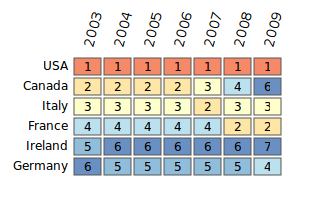

# D3 Sortable Heatmap

The name just about says it all for this project.  Heatmap.html is a heatmap that uses d3js and can be sorted by column or row.

You can see a working demo of this heatmap [here](https://fhightower.github.io/d3js-sortable-heatmap/heatmap.html).

**Disclaimer:** I am just starting to learn javascript and this is my first project using javascript, so any feedback is greatly appreciated.  I will be going back through this project and doing some cleanup in the near future.  Thanks!

This is inspired by the heatmap [here](https://jsfiddle.net/nrabinowitz/Lk5Pw/ "d3js Heatmap Example").